# MovieTracker


MovieTracker is a web application for movie enthusiasts.  
It allows users to browse movies, explore genres, and share reviews without requiring registration.

The platform helps users discover what to watch by displaying the latest published movies and ranking genres based on popularity.

## 1. Features

### Movies

- Add new movies
- Edit existing movies
- Delete movies (with confirmation)
- View detailed information about each movie
- Filter movies by genre
- Sort movies by publication date

### Reviews

- Add reviews to movies
- Display reviews inside movie details page

### Genres

- Add new genres
- Prevent duplicate genres

### Home Page

- Display latest published movies
- Show top genres based on movie count

## 2. Tech Stack

### Backend

- ASP.NET Core MVC (.NET 10)
- C#
- Entity Framework Core 8

### Database

- SQL Server Express

### Frontend   

- HTML5
- CSS3
- Bootstrap

### Development Tools

- Visual Studio 2026 Insiders

### Architecture

- Model-View-Controller (MVC) pattern

## 3. Installation

> ### **Requirements**   
>
> - .NET 10 SDK
> - SQL Server Express
> - Visual Studio 2026 Insiders
> - Entity Framework Core 8 (via NuGet)

### Installation Steps

1. Clone the repository:  

   ```bash 
   git clone <repository-url>
   ```
2. Open the solution file in Visual Studio 2026 Insiders.
3. Configure the connection string in appsettings.json if needed.
4. Open Package Manager Console and run:   

   ```bash 
   Update-Database    
   ```
This will apply the migrations and create the database.   

5. Press F5 or Ctrl + F5 to run the application.   

## 4. Configuration

>Before running the application, make sure the database connection is correct.

- The connection string is in appsettings.json:   
    
 ```json
"ConnectionStrings": {   
    "DefaultConnection": "Server=.\\SQLEXPRESS;Database=MovieTrackerDb;Trusted_Connection=True;"   
}
   ```

- .\\SQLEXPRESS points to your local SQL Server Express instance.
- No additional environment variables are required.
- Make sure you apply migrations using Update-Database in the Package Manager Console before running the app.

## 5. Usage

### Home Page

You don't need registration to use the app.

- The navigation menu contains:
  - **MovieTracker** (click to return to home)
  - **Home**
  - **Movies**
  - **Genres**

- Below the heading you can see:
  - The last 5 published movies
  - The 5 genres with most movies

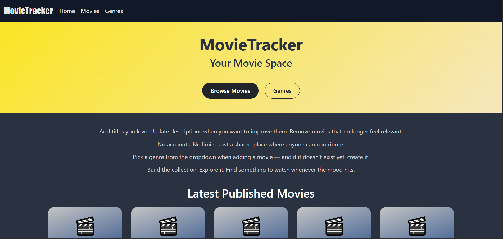
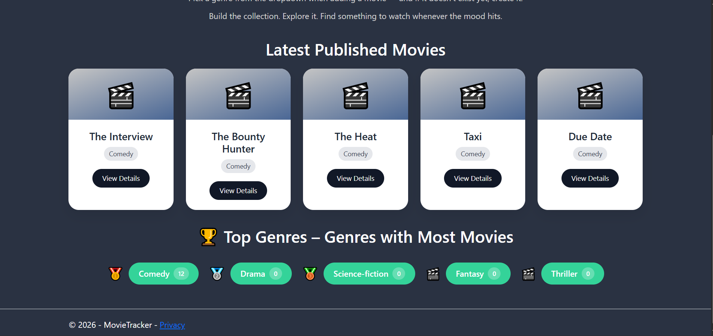

- Clicking **View Details** opens a modal showing:
  - Movie title
  - Date of publishing
  - Description


- Clicking a genre redirects to the Movies page with a filter applied.


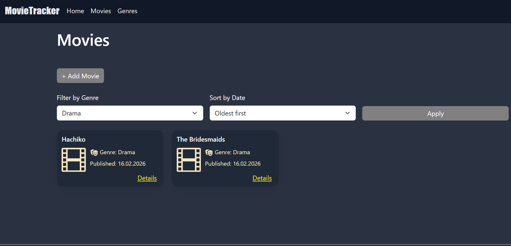

---

### Movies Page

- By default, all movies are displayed, ordered by oldest first.
- Filters:
  - Select a genre
  - Select sorting by newest first
  - Apply changes using the **Apply** button

### Add Movie

- Click **Add Movie** to open the form with 3 required fields.
- The dropdown shows all existing genres. If the genre doesn't exist, you can add it from the **Add Genre** form.
- After submitting, you are redirected to the Movies page and a success message appears.

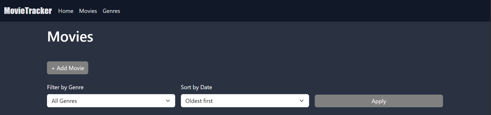
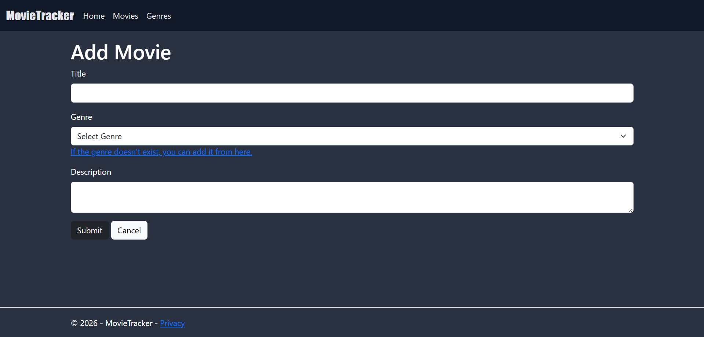
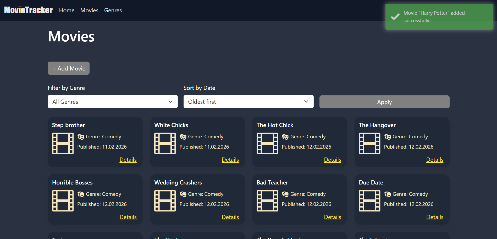

### Movie Details

- Options:
  - **Back** → returns to the Movies page
  - **Edit** → opens a form similar to Add Movie to modify title, genre, or description
  - **Delete** → confirmation pop-up appears
  - **Add Review** → adds a review and shows a success message

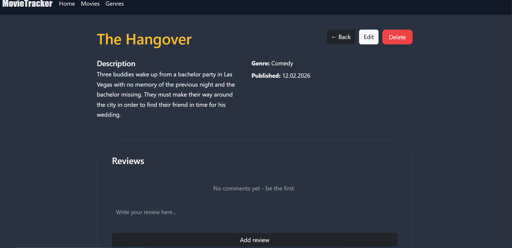
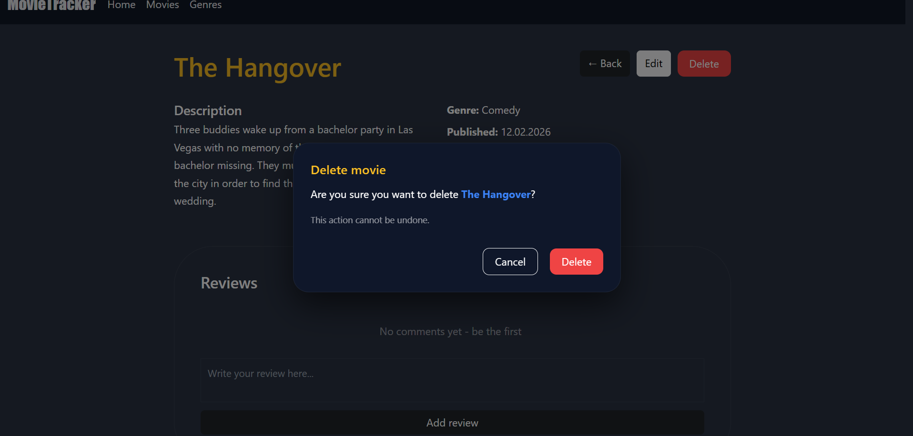
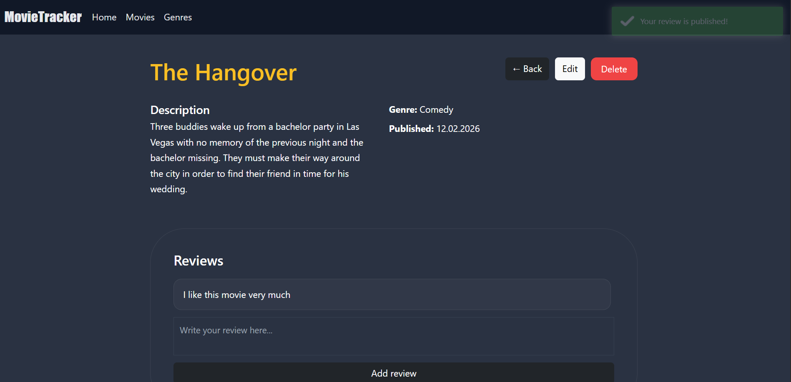

---

### Genres Page

- Lists all existing genres.
- You cannot delete or edit genres.
- If no genres exist, movie-related features are disabled.

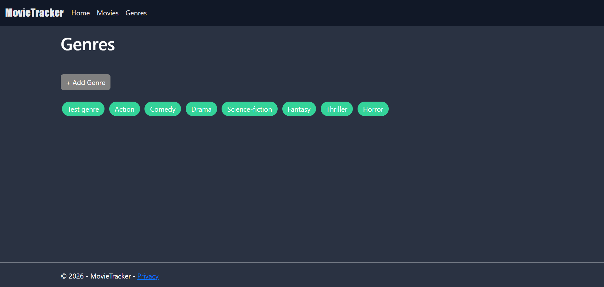

### Add Genre

- Click **Add Genre** to open the form.
- Adding a duplicate genre is not allowed.

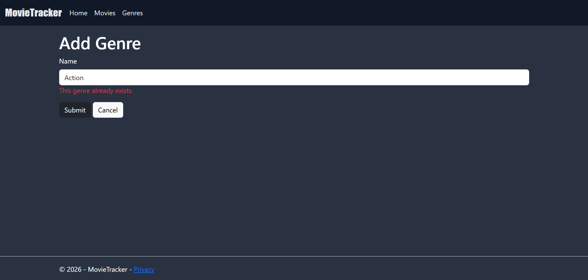
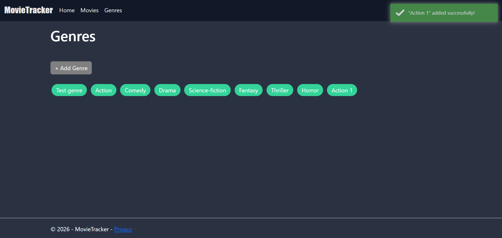
